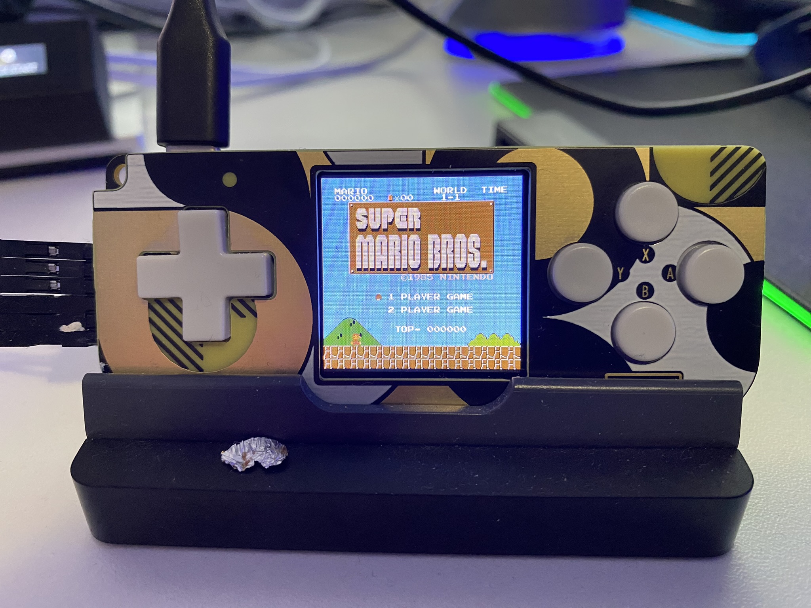
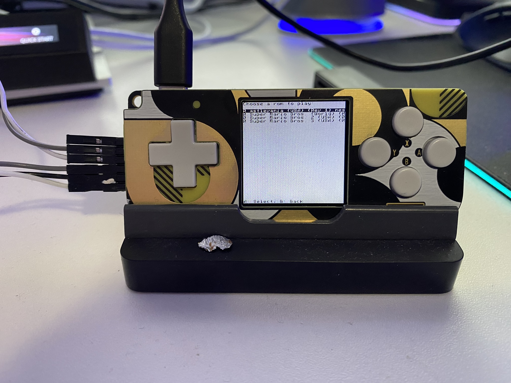
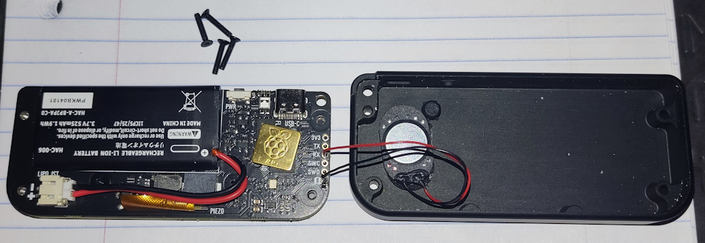
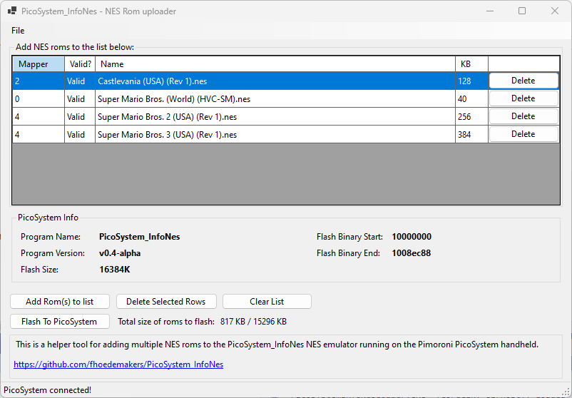

# PicoSystem_InfoNes a NES emulator for the Pimoroni PicoSystem RP2040 gaming handheld

## What is it

A Nintendo NES emulator for the [Pimoroni PicoSystem](https://shop.pimoroni.com/products/picosystem) RP2040 gaming handheld.

Emulater is bundled with the freeware homebrew game [Blade Buster](https://www.rgcd.co.uk/2011/05/blade-buster-nes.html).

See below for instructions how to flash the emulator on the PicoSystem and how to load games.

Store and play multiple Nintendo NES games on the Pimoroni PicoSystem RP2040 gaming handheld. A menu system is included for choosing your games to play.

There are two options for sound playback:

- [Using the internal speaker. Low quality](#sound-through-internal-speaker)
- [Using an easy to do speaker mod, better quality](#speaker-mod-for-better-sound)

[See below for more info on sound](#sound)

(Note: Screenshots below do not represent the actual picture quality. The distortion is caused by the camera)

|  ||
| ------------- | ------------- |
|  |   |


Click on image below to see a demo video. [For more videos, including sound, see below](#videos-with-sound).

[](https://www.youtube.com/watch?v=4VYKSMvYWc8)

## Where to buy the PicoSystem

- UK: [https://shop.pimoroni.com/products/picosystem?variant=32369546985555](https://shop.pimoroni.com/products/picosystem?variant=32369546985555)
- EU: [https://www.kiwi-electronics.com/en/picosystem-10913?search=picosystem](https://www.kiwi-electronics.com/en/picosystem-10913?search=picosystem)
- US: [https://www.adafruit.com/product/5289](https://www.adafruit.com/product/5289)

## Sound
### Sound through internal speaker
Sound through the internal piezo speaker is working but limited due to the limitations of this speaker. 

### Speaker mod for better sound
The sound quality will be much better (but not perfect and still somewhat limited) by modding the PicoSystem with a 8 Ohm 1W magnetic speaker. 
Those can be found [here for US](https://www.amazon.com/gp/product/B082658QXL/ref=ppx_yo_dt_b_search_asin_title?ie=UTF8&psc=1) and [here for Europe](https://www.amazon.nl/gp/product/B0BTYDS6FY/ref=ppx_od_dt_b_asin_title_s00?ie=UTF8&psc=1)


> This requires opening up the PicoSystem and some soldering. It is a simple mod, but I don't take responsibility when the PicoSystem gets damaged.

The speaker must be soldered with the red wire to RX and the black wire to ground (pad with the  **-** sign) as shown below:



> You can toggle between speakers in-game by the Y + Down button combo.

### Videos with sound


| hear the difference between speakers  |Show the capabilities of the speaker mod|
| ------------- | ------------- |
| [](https://youtu.be/BRUByhx4GDo) | [](https://youtu.be/cA9mOWZZN6I) |


## Software installation

### flashing the emulator and uploading games to the PicoSystem using a Windows App
Since there is no SD card slot available, a companion app for Microsoft Windows is created that lets the user choose games and flash them to the Pico.
[More information here](https://github.com/fhoedemakers/PicoSystemInfoNesLoader). 

[The Windows application is also included in the latest release of this repository](https://github.com/fhoedemakers/PicoSystem_InfoNes/releases). 

The application also allows you to flash the emulator when not installed or a newer version is available. No more need for manually flashing.



### Manual installation
If you don't want or can't to use the Windows Application

#### Manually flashing the emulator on PicoSystem

- Download **PicoSystem_InfoNes.uf2** from the [releases page](https://github.com/fhoedemakers/PicoSystem_InfoNes/releases/latest).
- Connect PicoSystem using an USB-C cable to your computer. Make sure the PicoSystem is switched off.
- Push and hold the X button then the power-on button. Release the buttons and the drive RPI-RP2 appears on your computer.
- Drag and drop the UF2 file on to the RPI-RP2 drive. The PicoSystem will reboot and will now run the emulator.

#### Manually uploading a single game

> Game must have the .nes extension

Load single game rom by setting the device in BOOTSEL mode. (Connect to computer then Hold X and power on device)
The ROM should be placed at address **0x10110000**, and can be  transferred using [picotool](https://github.com/raspberrypi/picotool).

```
picotool load rom.nes -t bin -o 0x10110000
```

**Attention: the upload address has been changed from 0x10080000 to 0x10110000.** This is because of the additional size of the built-in game baked into the executable.

#### Manually uploading multiple games

> All games must have the .nes extension and must be in the same directory

This can be done by creating a tar archive and upload this archive to the PicoSystem. The maxium size of the archive is be about 15MB

```bash
# current directory must contain the .nes roms
tar cvf games.tar *.nes
picotool load games.tar -t bin -o 0x10110000
```


## Button maps

- Y: is mapped to NES Select
- X: is mapped to NES Start

### In-game
- Y + X: Opens in-game menu. Browse options with UP/DOWN:
  - A Back to games list menu (quit), B Resume game (close).
  - Toggle rapid fire A button. Press A to toggle.
  - Toggle rapid fire B button. Press A to toggle.
  - Change brightness. Press LEFT or RIGHT to change.
- Y + LEFT: Previous game
- Y + RIGHT: Next Game
- Y + UP: Start built-in freeware game [Blade Buster](https://www.rgcd.co.uk/2011/05/blade-buster-nes.html)
- Y + Down: Toggle between speakers. (Built-In - Added via Mod - Both - Mute)
- X + A: Toggle framerate.
- Y + A: Volume up
- Y + B: Volume down

> Speaker selection, volume level and brightness setting will be saved, but only when you reset to the games list menu (X + Y, then A) or toggle between games (Y + Left, Y + Right, Y + Up). Powering-off the device will not save these settings.

### In-Game list menu
- Up/DOWN: Scroll through game list
- A : Start selected game
- B : Exit menu

## Battery status
The battery status is shown when activating the in-game menu. When battery level drops to 10 percent or below, the indicator is permanently shown.

## Screen Resolution
The original Nintendo Entertainment System has a resolution of 256x240 pixels. The PicoSystem has a resolution of 240x240 pixels. Therefore, on the PicoSystem the first and last 8 Pixels of each horizontal line are not visible.

## Credits
InfoNes is programmed by [Jay Kumogata](https://github.com/jay-kumogata/InfoNES) and ported for DVI output to the Raspberry PI Pico by [Shuichi Takano](https://github.com/shuichitakano/pico-infones). I used the port of Shuichi Takano as a starting point for this project.

Sound programmming by [newschooldev](https://github.com/newschooldev) and [Layer812](https://github.com/Layer812)

## Things to do

- Code has to be cleaned up. Uses parts of the [PicoSystem library](https://github.com/pimoroni/picosystem).
